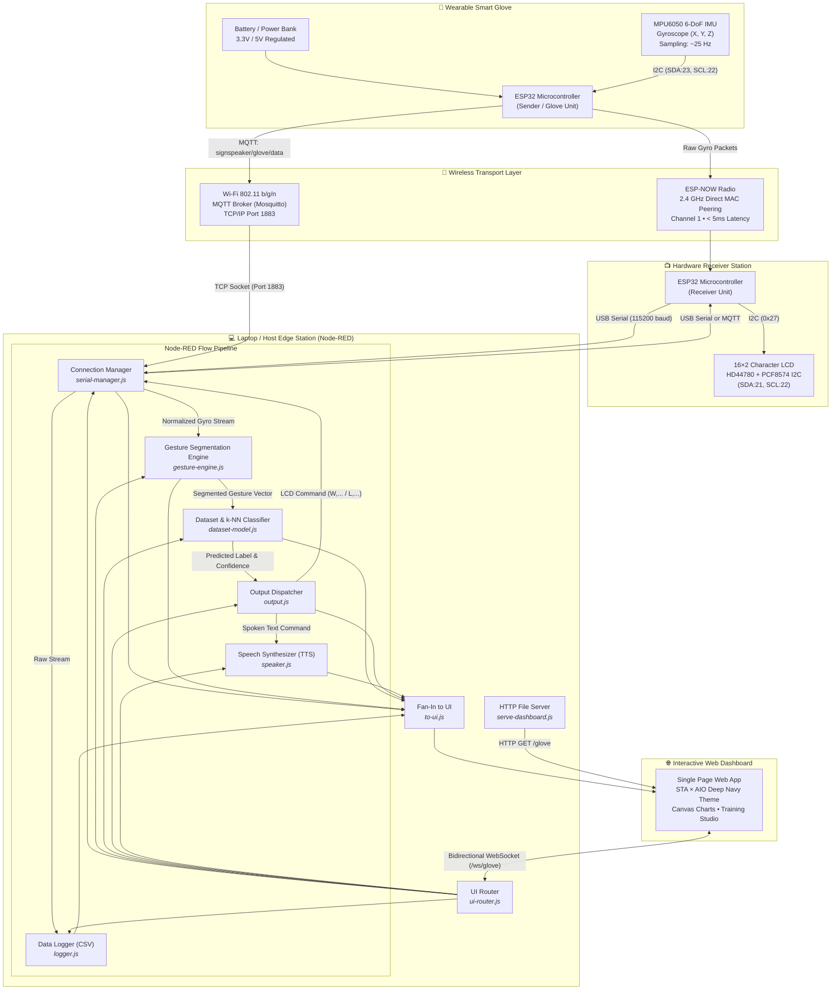
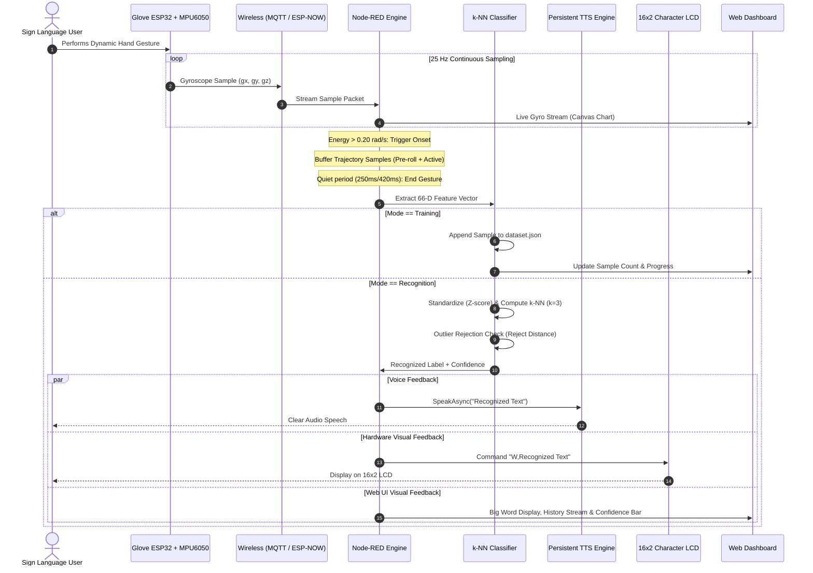
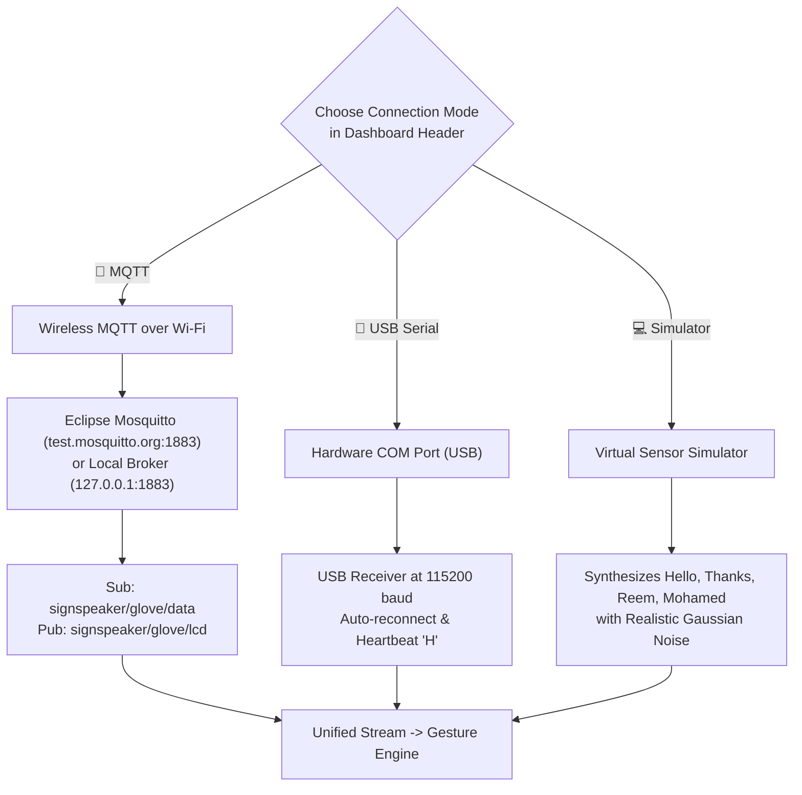
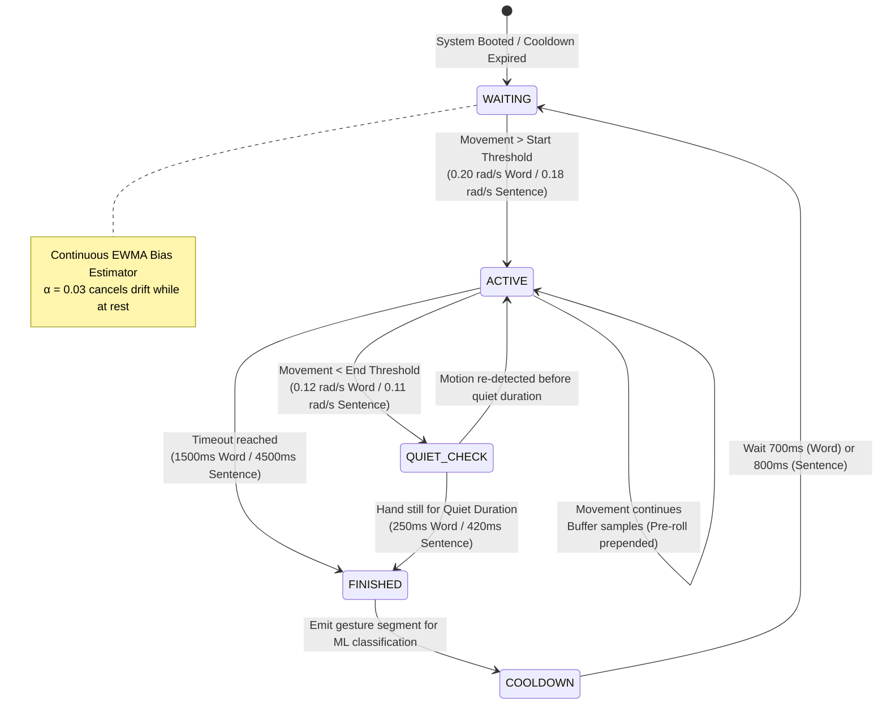

# SignSpeaker — Complete System Documentation

<p align="center">
  <b>Joint Applied Engineering Project</b><br>
  <b>Elsewedy Technical Academy (STA) × Arab International Optronics (AIO)</b><br>
  <i>Smart Glove Gesture Recognition & Real-Time Speech Synthesis System</i>
</p>

---

## 📌 Executive Summary

**SignSpeaker** is an end-to-end wearable assistive technology system that translates dynamic Egyptian Sign Language gestures and hand motions into real-time spoken audio and LCD text. Designed and engineered through a collaboration between **Elsewedy Technical Academy (STA)** and **Arab International Optronics (AIO)**, the system combines wearable inertial sensing, wireless telemetry, real-time stream segmentation, lightweight embedded machine learning (k-NN), text-to-speech synthesis, and an interactive web dashboard.

### Key Capabilities
- **Dual Wireless Modes**: Fully untethered operation via **MQTT over Wi-Fi** or low-latency point-to-point **ESP-NOW radio**.
- **Edge Machine Learning**: Resampled trajectory feature extraction (66 features) and weighted k-Nearest Neighbors (k-NN, $k=3$) with statistical outlier rejection.
- **Word & Sentence Modes**: Supports single words as well as multi-word continuous sentences (up to 48 characters) with adaptive segmentation timing.
- **Instant Speech Synthesis**: Persistent Windows speech synthesis engine (`System.Speech.Synthesis`) eliminating cold-start latency for real-time vocal feedback.
- **Smart 16×2 LCD Output**: Autonomous word boundary wrapping splits sentences cleanly across dual-line hardware displays.
- **Zero-Latency Web Dashboard**: Dark-navy industrial cockpit serving real-time 60 FPS sensor traces, sample recording, model inspection, and connection management.

> [!IMPORTANT]
> - **Front-Door Landing Page**: [http://127.0.0.1:1880/glove](http://127.0.0.1:1880/glove) or [http://127.0.0.1:1880/](http://127.0.0.1:1880/)  
>   Served directly by Node-RED from [dashboard/landing.html](file:///d:/DATA-1/Projects/SignSpeaker%20Project/dashboard/landing.html).
> - **Operational Live Cockpit**: [http://127.0.0.1:1880/glove/dashboard](http://127.0.0.1:1880/glove/dashboard)  
>   Served directly by Node-RED from [dashboard/index.html](file:///d:/DATA-1/Projects/SignSpeaker%20Project/dashboard/index.html).
> - **Interactive Flowcharts Studio**: [http://localhost:3000](http://localhost:3000) or [http://127.0.0.1:1880/glove/flowcharts](http://127.0.0.1:1880/glove/flowcharts)  
>   Served standalone via [flowcharts/server.js](file:///d:/DATA-1/Projects/SignSpeaker%20Project/flowcharts/server.js) and integrated into Node-RED.
> - **Official GitHub Repository**: [mo7amedmaher28-byte/SignSpeaker-glove](https://github.com/mo7amedmaher28-byte/SignSpeaker-glove.git)

---

## 🏗️ System Architecture



---

## 🔄 End-to-End System Sequence



---

## ⚡ Hardware Wiring & Pinout Specifications

### 1. Glove / Sender ESP32 (Transmitter)
Reads angular velocities along the X, Y, and Z axes from the MPU6050 IMU.

| MPU6050 Pin | ESP32 Pin | Description |
|---|---|---|
| **VCC** | **3.3V** | Regulated logic power |
| **GND** | **GND** | Ground reference |
| **SDA** | **GPIO 23** | I2C Data bus |
| **SCL** | **GPIO 22** | I2C Clock bus |
| **INT** | *Not Connected* | Polled via software timer at 25 Hz |
| **AD0** | **GND** | Sets I2C slave address to `0x68` |

> [!TIP]
> The sender unit can be powered completely untethered using a lightweight 3.7V LiPo battery paired with a 3.3V LDO regulator, or directly via any standard USB 5V portable power bank.

---

### 2. Receiver Station ESP32
Receives wireless packets and controls the 16×2 character display via an I2C backpack.

| LCD (PCF8574) Pin | ESP32 Pin | Description |
|---|---|---|
| **VCC** | **5V (VIN)** | 5V supply for LCD backlight & logic |
| **GND** | **GND** | Ground reference |
| **SDA** | **GPIO 21** | I2C Data bus (Address: `0x27`) |
| **SCL** | **GPIO 22** | I2C Clock bus |

---

## 🌐 Connection Modes & Telemetry

SignSpeaker provides **3 unified connection methods** switchable directly from the dashboard header with zero page reload:



| Connection Mode | Primary Benefit | Hardware Required | LCD Support | Audio TTS |
|---|---|---|---|---|
| **📶 Wireless MQTT** | 100% untethered, works across rooms/networks | Glove ESP32 + Wi-Fi | Via MQTT topic | ✅ Active |
| **🔌 USB Serial (Receiver)** | Lowest latency, direct hardware LCD driving | Glove + Receiver ESP32 | ✅ Physical 16×2 | ✅ Active |
| **🔌 USB Serial (Sender Direct)** | Single ESP32 bench testing | Glove ESP32 + USB cable | ❌ None | ✅ Active |
| **💻 Simulator** | Software debugging without any physical boards | None (Pure software) | Virtual LCD | ✅ Active |

---

## 🧠 Gesture Segmentation State Machine

The gesture segmentation engine runs continuously at ~25 Hz in [gesture-engine.js](file:///d:/DATA-1/Projects/SignSpeaker%20Project/node-red/functions/gesture-engine.js). It dynamically isolates deliberate hand gestures from resting hand drift and baseline sensor bias.



### Parameter Tuning: Single Words vs. Multi-Word Sentences

| Parameter | Word Mode (Default) | Sentence Mode | Purpose |
|---|---|---|---|
| **Start Threshold** | `0.20 rad/s` | `0.18 rad/s` | Motion energy required to trigger gesture onset |
| **End Threshold** | `0.12 rad/s` | `0.11 rad/s` | Motion energy boundary marking gesture conclusion |
| **Quiet Duration** | `250 ms` | `420 ms` | Sustained stillness required before finalizing |
| **Min Gesture Time**| `120 ms` | `300 ms` | Filters out accidental twitches and noise |
| **Max Gesture Time**| `1500 ms` | `4500 ms` | Maximum continuous buffer duration |
| **Cooldown Time** | `700 ms` | `800 ms` | Prevents re-triggering during hand return |
| **Pre-roll Buffer** | `3 samples` | `3 samples` | Prepends samples immediately before onset |

---

## 🔬 Feature Extraction (66-Dimensional Vector)

Raw variable-length sensor recordings are transformed into a normalized 66-dimensional feature representation in [dataset-model.js](file:///d:/DATA-1/Projects/SignSpeaker%20Project/node-red/functions/dataset-model.js):

| Vector Index | Feature Name | Dimensions | Mathematical Description |
|---|---|---|---|
| **0** | `Duration` | 1 | Total gesture elapsed time in seconds |
| **1 – 15** | `Per-Axis Statistics` | 15 | Range, Mean, Standard Deviation, Mean Absolute Value, and Absolute Peak for Gyro X, Y, and Z |
| **16 – 17** | `Magnitude Statistics` | 2 | Vector magnitude $\|G\| = \sqrt{gx^2 + gy^2 + gz^2}$ (Mean and Peak) |
| **18 – 65** | `Resampled Trajectory`| 48 | 16 equidistant points linearly interpolated across time $\times$ 3 axes ($16 \times 3 = 48$) |
| **Total** | **Full Feature Vector**| **66** | Fully normalized via dataset Z-score standardization |

### Classification & Outlier Rejection
1. **Z-Score Normalization**: Every incoming feature vector is standardized using precomputed dataset feature means $\mu_i$ and standard deviations $\sigma_i$:
   $$z_i = \frac{x_i - \mu_i}{\sigma_i}$$
2. **Weighted k-NN ($k=3$)**: Distances to all training vectors are calculated using Euclidean metric:
   $$d(u, v) = \sqrt{\sum_{i=1}^{66} (u_i - v_i)^2}$$
3. **Statistical Outlier Rejection**: A prediction is rejected as `"Unknown"` if the nearest neighbor distance exceeds the precomputed adaptive threshold:
   $$\text{Threshold} = 1.5 \times \text{95th percentile of leave-one-out same-class distances}$$
4. **Confidence Gating**: The model outputs a confidence score based on neighbor inverse distance weighting. Only predictions meeting `minConfidence` (default `0.55`) are accepted.

---

## 🎨 Dashboard Architecture & User Experience

The dashboard at `http://127.0.0.1:1880/glove` was completely re-architected into a modern, responsive layout:

```
┌────────────────────────────────────────────────────────────────────────────────────────────────────────────┐
│ [STA Logo] × (AIO) 🖐️ SignSpeaker  [ Train | Recognize ]  [📶 MQTT | 🔌 USB Serial | 💻 Sim] [✓ Connect] [●]│ (64px Header)
├───────────┬────────────────────────────────────────────────────────────────────────────────────────────────┤
│ 🏠 Dash   │  ┌──────────────────────────────────────────────┐  ┌────────────────────────────────────────┐  │
│ 🎓 Train  │  │  📈 Live Gyroscope Sensor (60 FPS Canvas)   │  │  🎯 Record Training Samples            │  │
│ 🧠 Models │  │     X (Blue) • Y (Green) • Z (Amber)         │  │     Target: [ Mohamed              ]  │  │
│ 📊 Samples│  │     Live Cooldown & Movement Magnitude       │  │     [ ▶ Start recording "Mohamed"  ]  │  │
│ ⚙️ Settings│  ├──────────────────────────────────────────────┤  ├────────────────────────────────────────┤  │
│           │  │  📊 Last Completed Gesture Trace             │  │  🧠 Model Status (Accuracy & Confusion)│  │
│           │  ├──────────────────────────────────────────────┤  ├────────────────────────────────────────┤  │
│           │  │  ⚙️ Gesture Engine Thresholds & Gyro Bias    │  │  📁 Snapshot Save / Restore Manager   │  │
│ (Fixed    │  └──────────────────────────────────────────────┘  └────────────────────────────────────────┘  │
│ Sidebar)  │  ┌──────────────────────────────────────────────────────────────────────────────────────────┐  │
│           │  │  📺 Virtual LCD Mirror • 🔊 Output Settings (Voice, Rate) • 💻 Synthetic Simulator Panel│  │
└───────────┴──┴──────────────────────────────────────────────────────────────────────────────────────────┴──┘
```

### Layout Stability Standards
- **Strict Fixed 64px Header**: The top app bar is locked to `height: 64px; min-height: 64px; max-height: 64px;` with `overflow-x: auto;`.
- **Standardized Control Sizing**:
  - Interactive buttons, segmented pills, and dropdowns: strictly **36px height**.
  - Status indicators (`#mainConnPill`, `#wsPill`): strictly **32px height**.
  - COM Port selection: bounded to **135px width** with text ellipsis truncation to prevent horizontal stretching.
  - Buttons and labels enforce `white-space: nowrap;` to eliminate vertical wrapping across all viewports.
- **Fixed Sidebar Navigation**: `position: sticky; top: 64px; height: calc(100vh - 64px);` keeps menu items stationary while main content scrolls smoothly.
- **Dual Partner Branding**: Crisp, white-pill containers proudly displaying the official **Elsewedy Technical Academy (STA)** and **Arab International Optronics (AIO)** logos.

### 🏛️ Dedicated Front-Door Landing Page (`landing.html`)
To introduce visitors and stakeholders to the project before entering the live operational cockpit, a dedicated landing page was engineered at `http://127.0.0.1:1880/glove`:
- **Partner Showcase**: In-depth institutional profiles for **Elsewedy Technical Academy (STA)** and **Arab International Optronics (AIO)** with high-definition brand assets.
- **Project Identity & Vision**: Highlighting the **SignSpeaker** assistive technology mission for Egyptian Sign Language users.
- **Interactive Simulation Demo**: An interactive preview console with real-time 3-axis canvas waveforms, simulated 16×2 LCD screen wrapping, and browser speech synthesis.
- **Hardware & Telemetry Matrix**: Comprehensive technical comparison covering 25 Hz sampling, 66-D features, ESP-NOW vs. MQTT, and microcontroller pinouts.
- **Dual-Route Dispatcher**:
  - `GET /glove` or `GET /` $\to$ [dashboard/landing.html](file:///d:/DATA-1/Projects/SignSpeaker%20Project/dashboard/landing.html) (Front door)
  - `GET /glove/dashboard` or `GET /glove?view=dashboard` $\to$ [dashboard/index.html](file:///d:/DATA-1/Projects/SignSpeaker%20Project/dashboard/index.html) (Operational Cockpit)
  - Cockpit header and sidebar include a persistent `← Overview` link to return to the landing page at any time.

---

## 🔊 Audio Speech Synthesis & Smart LCD Output

### Persistent PowerShell TTS Engine
Traditional CLI-based speech synthesis incurs a 1.2–2.0 second startup penalty each time a word is spoken. SignSpeaker uses a **persistent PowerShell background daemon** initialized at system boot in [speaker.js](file:///d:/DATA-1/Projects/SignSpeaker%20Project/node-red/functions/speaker.js):
- Keeps `System.Speech.Synthesis.SpeechSynthesizer` permanently in memory.
- Reads phrases via standard input (`stdin`) and speaks asynchronously without blocking the event loop.
- Supports voice selection (e.g. David, Zira) and speed adjustment directly from the dashboard.

### Smart 16×2 LCD Word Wrapping
Standard 16×2 LCDs truncate strings longer than 16 characters. SignSpeaker's [output.js](file:///d:/DATA-1/Projects/SignSpeaker%20Project/node-red/functions/output.js) incorporates an intelligent word boundary wrapping algorithm:
- Short words ($\le 16$ characters) render on Line 1 with status on Line 2.
- Sentences ($> 16$ characters) are scanned for whitespace boundaries closest to index 16.
- The string is cleanly divided across Line 1 and Line 2 without splitting individual words.

---

## 📂 Project Directory Structure

```
d:/DATA-1/Projects/SignSpeaker Project/
├── .gitignore                              # Git exclusion rules
├── Images/                                 # Brand assets & logos
│   ├── STA logo.jpg                        # STA logo badge (PNG format, cropped 300×116)
│   ├── AIO.png                             # AIO circular seal badge (cropped 260×260)
│   ├── STA_logo_raw.jpg                    # Original uncropped STA logo
│   ├── AIO_raw.png                         # Original uncropped AIO insignia
│   └── signspeaker_hero.jpg                # High-res wearable smart glove prototype render
├── firmware/                               # ESP32 Arduino firmware
│   ├── sender/sender.ino                   # Glove ESP32: MPU6050 → ESP-NOW radio
│   ├── receiver/receiver.ino               # Receiver ESP32: ESP-NOW → USB Serial + 16x2 LCD
│   ├── mqtt_sender/mqtt_sender.ino         # Glove ESP32: MPU6050 → Wi-Fi MQTT broker
│   └── mqtt_receiver/mqtt_receiver.ino     # Receiver ESP32: Wi-Fi MQTT → 16x2 LCD
├── node-red/                               # Backend Node-RED flows & business logic
│   ├── build-flows.js                      # Compiles functions/*.js into flows.json & deploys
│   ├── flows.json                          # Active deployed Node-RED flow configuration
│   └── functions/                          # Modular backend function nodes
│       ├── serial-manager.js               # Connection manager (MQTT, Serial COM, Simulator)
│       ├── gesture-engine.js               # Segmentation state machine & EWMA bias filter
│       ├── dataset-model.js                # Feature extraction (66-D), k-NN, dataset CRUD
│       ├── output.js                       # Output routing & smart LCD word wrapping
│       ├── speaker.js                      # Persistent PowerShell TTS daemon
│       ├── logger.js                       # Raw gyro stream CSV logging
│       ├── serve-dashboard.js              # HTTP server with dual-route landing/cockpit dispatcher
│       ├── ui-router.js                    # Inbound WebSocket dispatching
│       └── to-ui.js                        # Outbound WebSocket event aggregation
├── dashboard/                              # Web application
│   ├── landing.html                        # Front-door landing page (STA × AIO story, specs, demo)
│   └── index.html                          # Operational live cockpit (HTML5, Canvas, ES6)
├── flowcharts/                             # Interactive Architecture Flowcharts Studio
│   ├── index.html                          # Semantic HTML5 shell with 9 vector diagrams
│   ├── style.css                           # STA × AIO Dark Navy & Cyan design system
│   ├── app.js                              # Mermaid renderer, zoom/pan, search, filter, export
│   └── server.js                           # Dedicated Node.js HTTP server (Port 3000)
└── data/                                   # Persistent application state & models
    ├── dataset.json                        # Training recordings & sample arrays
    ├── model.json                          # Trained k-NN model vectors & stats
    ├── settings.json                       # Gesture thresholds, mode, gyro bias
    ├── output.json                         # Audio & LCD toggles, min confidence
    ├── serial.json                         # Last selected connection parameters
    ├── raw/gyro-YYYY-MM-DD.csv             # Daily sensor session audit logs
    └── saved/                              # Named model & dataset snapshots
```

---

## 📡 Protocol Specifications

### 1. Serial Stream Protocol (115200 Baud, 8-N-1)
Lines are terminated with standard newline `\n`.

| Direction | Format | Description | Example |
|---|---|---|---|
| ESP32 $\to$ Laptop | `D,<ms>,<gx>,<gy>,<gz>` | Raw gyro sample packet | `D,12480,0.12,-0.45,0.08` |
| ESP32 $\to$ Laptop | `I,<message>` | System status or info message | `I,ESP-NOW Receiver Ready` |
| Laptop $\to$ ESP32 | `H` | Keep-alive heartbeat (1 Hz) | `H` |
| Laptop $\to$ ESP32 | `W,<word>` | Display detected word for 2.0s | `W,Hello` |
| Laptop $\to$ ESP32 | `L,<line1>|<line2>` | Set idle display text | `L,SignSpeaker Ready|Listening...` |

---

### 2. MQTT Telemetry Protocol

| Topic | Direction | Payload | QoS | Retain | Description |
|---|---|---|:---:|:---:|---|
| `signspeaker/glove/data` | Glove $\to$ Broker | `D,<ms>,<gx>,<gy>,<gz>` | 0 | False | Live gyro data at 25 Hz |
| `signspeaker/glove/lcd` | Node-RED $\to$ Broker | `W,<word>` or `L,<l1>|<l2>`| 0 | False | Display commands for receiver |

---

### 3. WebSocket Event Bus (`/ws/glove`)

| Topic | Direction | Payload Structure | Description |
|---|---|---|---|
| `serial` | Backend $\to$ UI | `{mode, connected, rate, ports, mqttConnected, broker, lcd}` | Live connection and port state |
| `engine` | Backend $\to$ UI | `{mode, recording, label, phase, settings, bias}` | Segmentation engine telemetry |
| `phase` | Backend $\to$ UI | `{phase: "waiting" | "active" | "cooldown"}` | High-frequency phase changes |
| `dataset` | Backend $\to$ UI | `{labels, sampleCounts, samples, rev}` | Current training dataset inventory |
| `model` | Backend $\to$ UI | `{accuracy, confusion, featureCount, trainedAt, stale}` | Trained k-NN model diagnostics |
| `gesture` | Backend $\to$ UI | `{id, duration, sampleCount, features, prediction}` | Completed gesture details |
| `output` | Backend $\to$ UI | `{word, confidence, spoken, lcd}` | Recognized word output event |
| `toast` | Backend $\to$ UI | `{type: "info" | "success" | "error", text}` | User notification banners |

---

## 🚀 Setup & Execution Guide

### 1. Prerequisites
- **Node.js** (v18.x or v20.x recommended)
- **Node-RED** installed globally (`npm install -g --unsafe-perm node-red`)
- **Arduino IDE** (v2.x) with ESP32 board definitions installed

### 2. Launching the System
Open PowerShell in the project root:

```powershell
# Step 1: Start Node-RED backend daemon
node-red

# Step 2: (Optional) Rebuild and deploy flows if functions/*.js were modified
cd "node-red"
node build-flows.js

# Step 3: Open the dashboard in any modern web browser
Start-Process "http://127.0.0.1:1880/glove"

# Step 4: (Optional) Launch the Interactive Flowcharts Studio on localhost:3000
cd "flowcharts"
node server.js
Start-Process "http://localhost:3000"
```

### 3. Flashing ESP32 Firmware
1. Open Arduino IDE.
2. Install required libraries via Library Manager:
   - `PubSubClient` by Nick O'Leary
   - `Adafruit MPU6050` & `Adafruit Unified Sensor`
   - `LiquidCrystal_I2C` by Frank de Brabander
3. Select board: **ESP32 Dev Module**.
4. Open the firmware sketch:
   - **For Wireless MQTT**: [mqtt_sender.ino](file:///d:/DATA-1/Projects/SignSpeaker%20Project/firmware/mqtt_sender/mqtt_sender.ino) (Set `WIFI_SSID` and `WIFI_PASS`).
   - **For ESP-NOW + Hardware LCD**: [sender.ino](file:///d:/DATA-1/Projects/SignSpeaker%20Project/firmware/sender/sender.ino) and [receiver.ino](file:///d:/DATA-1/Projects/SignSpeaker%20Project/firmware/receiver/receiver.ino).
5. Compile and upload.

---

## 📝 Changelog & Engineering Record

| # | Milestone / Change | Key Technical Details | Impacted Files |
|:---:|---|---|---|
| **1** | **Partner Identity Integration** | Integrated Elsewedy Technical Academy (STA) and Arab International Optronics (AIO) badges, favicon, headers, and metadata. | `dashboard/index.html`, `Images/` |
| **2** | **Continuous Sentence Support** | Expanded feature vector to 66 dimensions with 16 trajectory points, extended max gesture duration to 4500ms, and added 48-character label support. | `gesture-engine.js`, `dataset-model.js`, `output.js` |
| **3** | **Wireless MQTT Integration** | Built wireless telemetry client for Eclipse Mosquitto and custom brokers; added MQTT configuration modal and code generator. | `serial-manager.js`, `build-flows.js`, `index.html` |
| **4** | **MQTT ESP32 Firmwares** | Created dedicated wireless sender (`mqtt_sender.ino`) and wireless LCD receiver (`mqtt_receiver.ino`) firmwares. | `firmware/mqtt_sender/`, `firmware/mqtt_receiver/` |
| **5** | **Selective Word Management** | Engineered interactive modal allowing selective word deletion with checkboxes and select-all capabilities. | `dataset-model.js`, `ui-router.js`, `index.html` |
| **6** | **Industrial Dashboard Refresh** | Transformed UI to dark navy (`#0b1329`) theme with elevated white cards matching custom design mockups. | `dashboard/index.html` |
| **7** | **MIME Magic-Byte Detection** | Implemented binary header inspection in HTTP server to properly serve JPEG/PNG assets regardless of file extension. | `serve-dashboard.js` |
| **8** | **Sticky Navigation Sidebar** | Positioned sidebar with `position: sticky; top: 64px; height: calc(100vh - 64px);` to lock navigation during page scroll. | `dashboard/index.html` |
| **9** | **Decoupled Connection State** | Fixed tab selection bug by isolating UI tab state from periodic backend heartbeats, enabling manual connection toggling. | `dashboard/index.html` |
| **10** | **Unified Connect / Disconnect** | Designed high-contrast SVG toggle button (Blue `#2563eb` Connect / Red `#dc2626` Disconnect) with live status pill. | `dashboard/index.html` |
| **11** | **Header Dimension Stabilization** | Enforced strict 64px header height, uniform 36px control heights, 32px pills, bounded 135px COM dropdown, and `white-space: nowrap;` for zero layout jumping. | `dashboard/index.html` |
| **12** | **Front-Door Landing Page & Dual-Route Dispatcher** | Engineered modern STA × AIO landing page (`landing.html`) with institutional partner profiles, photorealistic smart glove render (`signspeaker_hero.jpg`), interactive canvas demo, and dual-mode routing (`/glove` vs `/glove/dashboard`). | `landing.html`, `serve-dashboard.js`, `build-flows.js`, `index.html`, `Images/` |
| **13** | **Interactive Flowchart Studio & Architecture Explorer** | Engineered standalone responsive HTML5/CSS/JS website featuring all 9 system flowcharts in dynamic Mermaid vector SVG, interactive zoom & pan, fullscreen modal inspection, live search & category filters, code copy, SVG export, and dedicated port 3000 server with Node-RED `/glove/flowcharts` routing. | `flowcharts/`, `serve-dashboard.js`, `build-flows.js`, `dashboard/index.html`, `dashboard/landing.html` |
| **14** | **Streamlined UI Navigation** | Removed external Flowcharts Studio navigation buttons from both the landing page navbar and the live operational cockpit header for a focused, distraction-free application experience. | `dashboard/landing.html`, `dashboard/index.html`, `README.md` |
| **15** | **Phase 2 Engineering Plan (Flex + Gyro Fusion)** | Authored comprehensive 5-page architectural specification and engineering plan (PDF) detailing the hardware circuit, pinout mapping (ADC1 only), extended 9-field telemetry packet, firmware state machine with on-device calibration, 121-dimensional feature vector (66D gyro + 55D flex), k-NN hyperparameter tuning, dashboard articulation visualizers, simulator extensions, and risk matrix. | `Phase2_Flex_Sensor_Integration_Plan.pdf`, `README.md` |

---

<p align="center">
  <b>SignSpeaker Project</b> • Developed with pride by <b>STA × AIO</b>
</p>

